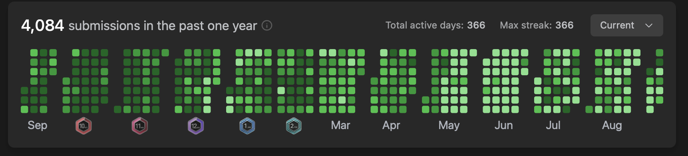

 

 

## ✨ About Me

I'm a **3rd-year ECE (IoT) student at NSUT (Netaji Subhas University of Technology)**, graduating in 2027 — but most of my clock time actually goes into shipping software, not circuits.

I like taking an idea from a blank file to something that actually runs in production: I've built a browser-based code editor, an AI document agent, a full-stack expense splitter, and I'm currently deep in a PII-redaction agent for LLM pipelines. Outside of building, I spend a good chunk of my day on DSA — Java is my weapon of choice — grinding LeetCode and Codeforces to stay sharp for interviews.

<table width="100%">
<tr>
<td width="60%" valign="top">

- 🎓 **ECE (IoT)** @ NSUT — Class of 2027
- 🛠️ Full-stack dev — comfortable end-to-end on the **MERN stack**
- 🧩 Deep focus on **DSA & problem solving** (Java)
- 🤖 Currently building an **AI-powered PII Sanitization Agent**
- 🌍 Open-source contributor — **GSSoC**
- 💼 Prior internship experience @ **Nexel**
- 🎯 Actively interviewing for **SDE Internship / New-Grad** roles
- ⚡ Fun fact: my LeetCode streak has stayed unbroken for over a year

</td>
<td width="40%" align="center">

</td>
</tr>
</table>

 

## 🛠️ Tech Stack

  

  

  

  

  

  

  

  

 

## 🏆 Coding Profiles

  
  &nbsp;&nbsp;&nbsp;&nbsp;
  
  &nbsp;&nbsp;&nbsp;&nbsp;
  
  &nbsp;&nbsp;&nbsp;&nbsp;
  

  

 

## 🤝 Let's Connect

 

### 💭

> *"Code never lies, comments sometimes do."*
> — **Ron Jeffries**

 

**Thanks for stopping by — let's build something great together! 🚀**

